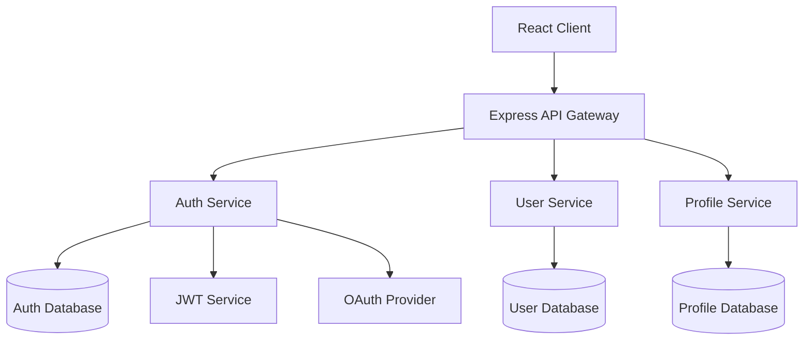

## Spec

**"Give structure before writing code"** - Full compliance with Kiro's spec-driven development

Unlike traditional code generation tools, this realizes Kiro's specification-driven development that focuses on giving structure to development chaos. From minimal requirement input, it progressively expands from product manager-level detailed specifications to implementable design, ensuring consistent quality **from prototype to production environment**.

### Usage

```bash
# Request Spec Mode from Claude (minimal requirement input)
"Create spec for [feature description]"

# Kiro-style progressive expansion:
# 1. Simple requirements → Automatic detailed user story generation
# 2. Structured requirement documentation using EARS notation
# 3. Specification refinement through progressive dialogue
# 4. Generation of 3 independent files:
#    - requirements.md: Requirement definition using EARS notation
#    - design.md: Design including Mermaid diagrams and TypeScript interfaces
#    - tasks.md: Implementation plan with automatic best practice application
```

### Proven Results (Kiro Track Record)

**Secure File Sharing App in 2 Days**

```bash
"Create spec for file sharing system (encryption support)"
→ Production-level encrypted file sharing application completed in 2 days
→ Automatic application of security best practices
→ No additional prompts required
```

**Game Development in One Night (Inexperienced Developer)**

```bash
"Create spec for 2D puzzle game"
→ Open source developer with no game development experience
→ Game creation completed in one night
→ Kiro handled implementation logic, developer focused on creativity
```

**Weekend Prototype → Production**

```bash
"Create spec for EC site product management system"
→ From concept to working prototype in one weekend
→ Consistent quality from prototype to production environment
→ Structured approach through spec-driven development
```

### Basic Examples

```bash
# New feature spec creation (minimal input)
"Product review system
- Star rating feature
- Comment posting
- Image upload"

# System feature spec creation
"User authentication
- OAuth support
- Multi-factor authentication"

# API feature spec creation
"Payment system API
- Stripe integration
- Security-focused"
```

### Integration with Claude

```bash
# Complex feature spec
"Create spec for chat feature. Include WebSocket, real-time notifications, and history management"

# Database integration feature spec
"Create spec for EC site inventory management feature. Include product addition, inventory updates, and alert functionality"

# Frontend feature spec
"Create spec for React dashboard. Include graph display, filters, and export functionality"

# Backend feature spec
"Create spec for RESTful API. Include authentication, validation, and logging"
```

### Spec Mode Characteristics

**Progressive Dialogue Workflow**

- Complete reproduction of Kiro's original value of progressive discussion
- Collaborative specification refinement with users at each phase
- File generation through clarification of questions, discussion of options, and approval process

**3-Phase Interactive Expansion**

- **Phase 1**: Requirements Discovery → Discussion → Approval → `requirements.md` generation
- **Phase 2**: Design Exploration → Discussion → Approval → `design.md` generation
- **Phase 3**: Implementation Planning → Discussion → Approval → `tasks.md` generation

**Dynamic Specification Development**

- Resolving requirement ambiguities through dialogue
- Presentation and discussion of technical options
- Explanation of trade-offs and decision confirmation

### Detailed Examples

```bash
# Complex system functionality
"Create spec for online payment system. Include Stripe integration, security, and error handling"

# Frontend functionality
"Create spec for React components. Include state management, property design, and testing"

# Backend functionality
"Create spec for GraphQL API. Include schema design, resolvers, and authentication"

# DevOps functionality
"Create spec for CI/CD pipeline. Include test automation, deployment, and monitoring"
```

### Progressive Dialogue Workflow (Phase by Phase)

#### Phase 1: Requirements Discovery & Discussion

**1. Automatic Expansion from Minimal Input (Kiro Style)**

```
User: "User management system
- Login functionality
- Profile editing
- Admin privileges"

Claude: "Generating detailed user stories from requirements.
Is this understanding correct?

Auto-generated User Stories:
- User registration and authentication features (OAuth support)
- Profile management features (avatar, settings)
- Permission management features (RBAC)
- Password reset functionality
- Security audit logs

I've supplemented details not explicitly mentioned. Are there other necessary features?"
```

**2. Structured Requirement Documentation using EARS Notation**

```
Claude: "Structuring requirements using Kiro's EARS notation:

Requirements Definition using EARS Notation:

WHEN user attempts to log in
GIVEN correct email address and password are entered
THEN the system shall verify authentication
AND redirect to dashboard upon success

WHILE user is on profile editing screen
THE SYSTEM SHALL execute real-time validation
AND display preview of changes

WHERE admin privileges are required for functionality
IS access is attempted
THE SYSTEM SHALL verify permission level
AND deny access if insufficient"
```

**3. Automatic Completion of Edge Cases and Security Requirements**

```
Claude: "Based on Kiro's best practices, I've also considered the following cases:

Security Requirements (Auto-completion):
- Brute force attack countermeasures
- Session management and timeout
- CSRF protection and XSS countermeasures
- Password strength requirements

Edge Cases (Auto-detection):
- Concurrent login restrictions
- Account lock functionality
- Data consistency during migration
- Load balancing for high-volume requests

Are these requirements appropriate?"
```

**5. Phase 1 Completion and Approval**

```
Claude: "Requirements Phase is complete.
May I generate requirements.md?"
→ "Proceed" → requirements.md generation
```

#### Phase 2: Design Exploration & Discussion

**1. Codebase Analysis + Automatic Design Proposal (Kiro Style)**

```
Claude: "Analyzing existing codebase and proposing optimal architecture:

Codebase Analysis Results:
- Authentication: JWT + Express.js (v4.18.x)
- Database: PostgreSQL (v14+)
- Frontend: React + TypeScript (v18+)
- Existing Patterns: Repository pattern, Service layer separation

Kiro Recommended Architecture:
- Clean Architecture compliance
- Domain-Driven Design elements
- Partial application of CQRS pattern
- Automated security best practices

Shall we proceed with this design?"
```

**2. Visual Design with Mermaid Diagrams**

```
Claude: "Auto-generated system design with Mermaid diagrams:

Auto-generated Architecture Diagram:



Should I also generate data flow diagrams?"

```

**3. Automatic TypeScript Interface Generation**
```

Claude: "Auto-generating TypeScript interfaces based on design:

Auto-generated TypeScript Interfaces:

```typescript
// Domain entities
interface User {
  readonly id: UserId;
  readonly email: Email;
  readonly profile: UserProfile;
  readonly auth: AuthSettings;
  readonly permissions: Permission[];
  readonly createdAt: Date;
  readonly updatedAt: Date;
}

interface UserProfile {
  readonly displayName: string;
  readonly avatar: AvatarUrl;
  readonly preferences: UserPreferences;
}

interface AuthSettings {
  readonly passwordHash: PasswordHash;
  readonly mfaEnabled: boolean;
  readonly lastLoginAt: Date;
  readonly failedAttempts: number;
}

// Use cases
interface UserRepository {
  findById(id: UserId): Promise<User | null>;
  findByEmail(email: Email): Promise<User | null>;
  save(user: User): Promise<void>;
}

interface AuthenticationService {
  authenticate(credentials: LoginCredentials): Promise<AuthResult>;
  refreshToken(token: RefreshToken): Promise<AccessToken>;
}
```

Shall we proceed with this interface design?"

```

**4. Phase 2 Completion and Approval**
```

Claude: "Design Phase is complete.
May I generate design.md?"
→ "Proceed" → design.md generation

```

#### Phase 3: Implementation Planning & Discussion

**1. Automatic Best Practice Application (Kiro Style)**
```

Claude: "Generated implementation plan with automatic application of Kiro's best practices:

Auto-generated Implementation Strategy:

1. Security-First Development
   - Automatic integration of OWASP Top 10 countermeasures
   - Automatic implementation of encryption and hashing
   - Automatic generation of security tests

2. Clean Architecture Enforcement
   - Automatic implementation of layer separation
   - Automatic application of dependency inversion
   - Enforcement of testable design

3. Performance Optimization
   - Automatic implementation of caching strategies
   - Database optimization
   - Utilization of asynchronous processing

Shall we proceed with this approach?"

```

**2. Automatic Quality Checkpoint Configuration**
```

Claude: "Auto-configured quality checkpoints for each implementation stage:

Automated Quality Assurance Process:

Phase 3a: Backend Implementation

- [ ] Security scan (SAST/DAST)
- [ ] API specification testing (OpenAPI compliance)
- [ ] Performance testing (load and response)
- [ ] Vulnerability scan (dependencies and CVE)

Phase 3b: Frontend Implementation

- [ ] Accessibility testing (WCAG 2.1 AA)
- [ ] Browser compatibility testing
- [ ] Responsive design verification
- [ ] Security header confirmation

Phase 3c: Integration and Deployment

- [ ] E2E test suite
- [ ] CI/CD pipeline configuration
- [ ] Monitoring and logging setup
- [ ] Production environment security audit

All will be executed automatically. Are there additional quality standards?"

```

**3. Automatic Dependency and Risk Mitigation Analysis**
```

Claude: "Auto-analyzed implementation order and risk mitigation strategies:

Optimized Implementation Order:

Week 1: Infrastructure and Security Foundation

- Database design and schema creation
- Authentication foundation (JWT + session management)
- Security middleware implementation
- Basic API endpoints

Week 2: Core Feature Implementation

- User management functionality
- Profile management functionality
- Permission management system
- Validation and error handling

Week 3: Advanced Features and Optimization

- Multi-factor authentication implementation
- Audit log functionality
- Performance optimization
- Frontend integration

Auto-detected Risk Mitigation Strategies:

- Multi-factor authentication: Phased introduction (SMS → app authentication)
- Session management: Redis cluster configuration
- High-volume access: Rate limiting + CDN utilization
- Data consistency: Enhanced transaction management

Is this plan acceptable?"

```

**4. Phase 3 Completion and Approval**
```

Claude: "Implementation Planning Phase is complete.
May I generate tasks.md?"
→ "Proceed" → tasks.md generation

```

### Kiro-Specific Features

**EARS Notation (Easy Approach to Requirements Syntax)**
```markdown
# Kiro Standard EARS Notation Patterns

WHEN [situation/trigger]
GIVEN [preconditions]
THEN [system behavior]
AND [additional behavior]

WHILE [state/process]
THE SYSTEM SHALL [required behavior]
AND [related behavior]

WHERE [function/component]
IS [condition/state]
THE SYSTEM SHALL [response behavior]
```

**Auto-generation Features**

- **Mermaid Diagrams**: Automatic generation of architecture and data flow diagrams
- **TypeScript Interfaces**: Automatic creation of type definitions based on design
- **Best Practices**: Automatic integration of security and performance countermeasures
- **Quality Checkpoints**: Automatic configuration of phase-specific quality standards

**hooks Integration**

- Automatic quality checks on file save
- Automatic application of coding standards
- Automatic execution of security scans
- Automatic verification of OWASP Top 10 countermeasures

**Prototype → Production Quality Assurance**

- Consistent design through structured approach
- Enforcement of security-first development
- Automatic application of scalable architecture
- Integration of continuous quality management

### Important Notes

**Scope of Application**

- Spec Mode is optimized for feature implementation
- Use normal implementation format for simple fixes or small-scale changes
- Recommended for new feature development or complex feature modifications

**Quality Assurance**

- Clarification of completion criteria for each stage
- Design review before implementation
- Comprehensive quality standards including testing and accessibility

**Execution Notes**

- Resolve requirement ambiguities before proceeding to design stage
- Generate implementation tasks after design completion
- Emphasize approval process at each stage

### Trigger Phrases and Control

#### Progressive Workflow Control

**Start Triggers**

- "Create spec for [feature name]"
- "Want to develop [feature name] with spec-driven approach"
- "Design [feature name] from specifications"

**Phase Progression Control**

- **"Proceed"**: Complete current phase, generate file, move to next phase
- **"Modify"**: Adjust and improve content within current phase
- **"Restart"**: Restart current phase from beginning
- **"Explain in detail"**: Provide more detailed explanation or options
- **"Skip"**: Skip current phase and proceed to next (not recommended)

**File Generation Timing**

```
Phase 1 Complete → "Proceed" → requirements.md generation
Phase 2 Complete → "Proceed" → design.md generation
Phase 3 Complete → "Proceed" → tasks.md generation
```

### Execution Example (Progressive Flow)

```bash
# Usage example
User: "Create spec for user management system"

# Phase 1: Requirements Discovery
Claude: [Start requirements confirmation and discussion]
User: [Response, discussion, modifications]
Claude: "Requirements Phase is complete. May I proceed?"
User: "Proceed"
→ requirements.md generation

# Phase 2: Design Exploration
Claude: [Start design proposal and discussion]
User: [Technology selection, architecture discussion]
Claude: "Design Phase is complete. May I proceed?"
User: "Proceed"
→ design.md generation

# Phase 3: Implementation Planning
Claude: [Start implementation plan discussion]
User: [Priority, risk, effort discussion]
Claude: "Implementation Phase is complete. May I proceed?"
User: "Proceed"
→ tasks.md generation

# Completion
Claude: "Spec-driven development preparation is complete. Implementation can begin."
```

### Differences from /plan

| Feature | /plan | /spec |
|------|-------|-------|
| Target | General implementation planning | Feature specification-driven development |
| Output Format | Single planning document | 3 independent files (requirements.md, design.md, tasks.md) |
| Requirements Definition | Basic requirement organization | Detailed acceptance criteria using EARS notation |
| Design | Technology selection focused | Codebase analysis based |
| Implementation | General task breakdown | Sequence considering dependencies |
| Quality Assurance | Basic test strategy | Comprehensive quality requirements (testing, accessibility, performance) |
| Synchronization | Static planning | Dynamic spec updates |

### Recommended Use Cases

**Spec Usage Recommended**

- New feature development
- Complex feature modifications
- API design
- Database design
- UI/UX implementation

**Plan Usage Recommended**

- Overall system design
- Infrastructure construction
- Refactoring
- Technology selection
- Architecture changes